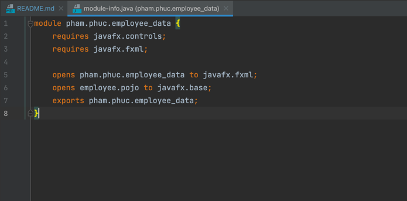
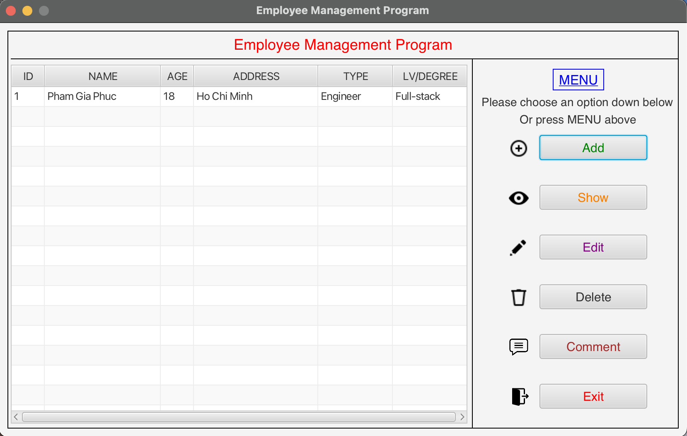
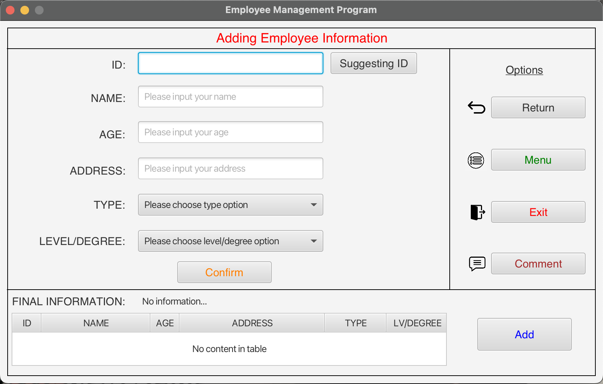
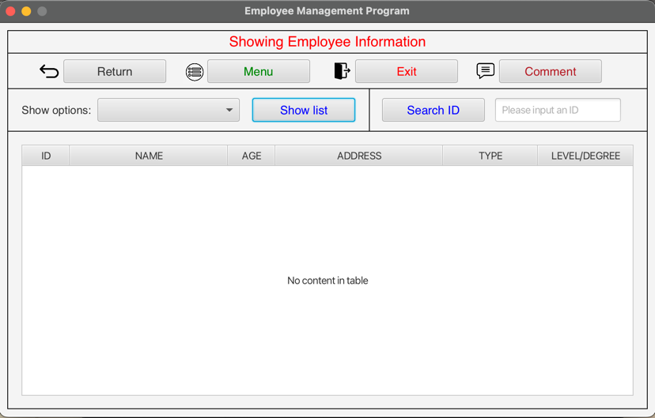
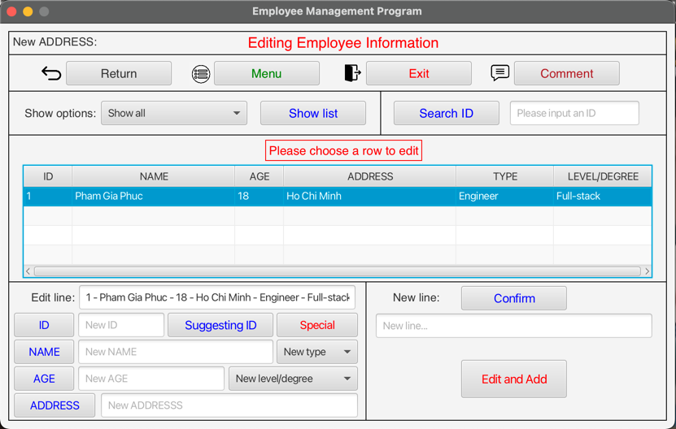
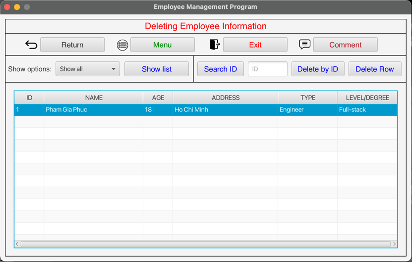
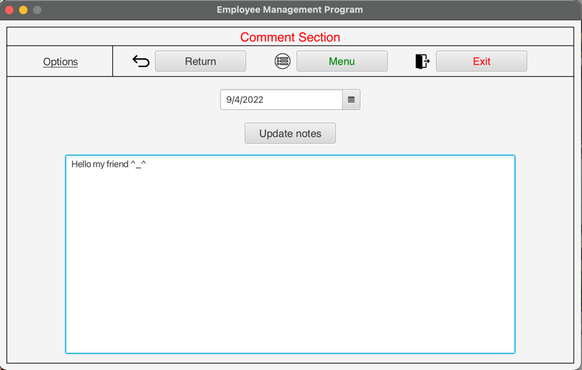

# Employee Management Application
- GitHub link: https://github.com/AcusPGP/EmployeeManageApplication
### Object oriented programming and JavaFX language

-----------------------------------
### STEP 1:  Before running program, you make sure your computer already installed tools below:

- JDK 18.0.2 or later.
- Maven 4.0.0 or later.
- OpenJFX 18 or later
- Check the module-info.java file. Maker sure it will look like this
  `(source: src/main/java/module-info.java)
`

`code:`
```
module pham.phuc.employee_data {
    requires javafx.controls;
    requires javafx.fxml;

    opens pham.phuc.employee_data to javafx.fxml;
    opens employee.pojo to javafx.base;
    exports pham.phuc.employee_data;
}
```
`picture:`



- Check the pom.xml file. Make sure it will look like this `(source: pom.xml)`

`code:`
```
<?xml version="1.0" encoding="UTF-8"?>
<project xmlns="http://maven.apache.org/POM/4.0.0"
         xmlns:xsi="http://www.w3.org/2001/XMLSchema-instance"
         xsi:schemaLocation="http://maven.apache.org/POM/4.0.0 https://maven.apache.org/xsd/maven-4.0.0.xsd">
    <modelVersion>4.0.0</modelVersion>
    <groupId>pham.phuc</groupId>
    <artifactId>Employee_Data</artifactId>
    <version>1.0-SNAPSHOT</version>
    <name>Employee_Data</name>

    <properties>
        <project.build.sourceEncoding>UTF-8</project.build.sourceEncoding>
        <junit.version>5.8.2</junit.version>
    </properties>

    <dependencies>
        <dependency>
            <groupId>org.openjfx</groupId>
            <artifactId>javafx-controls</artifactId>
            <version>18</version>
        </dependency>
        <dependency>
            <groupId>org.openjfx</groupId>
            <artifactId>javafx-fxml</artifactId>
            <version>18</version>
        </dependency>
        <dependency>
            <groupId>org.controlsfx</groupId>
            <artifactId>controlsfx</artifactId>
            <version>11.1.1</version>
        </dependency>
        <dependency>
            <groupId>com.dlsc.formsfx</groupId>
            <artifactId>formsfx-core</artifactId>
            <version>11.3.2</version>
            <exclusions>
                <exclusion>
                    <groupId>org.openjfx</groupId>
                    <artifactId>*</artifactId>
                </exclusion>
            </exclusions>
        </dependency>
        <dependency>
            <groupId>org.kordamp.bootstrapfx</groupId>
            <artifactId>bootstrapfx-core</artifactId>
            <version>0.4.0</version>
        </dependency>
        <dependency>
            <groupId>org.junit.jupiter</groupId>
            <artifactId>junit-jupiter-api</artifactId>
            <version>${junit.version}</version>
            <scope>test</scope>
        </dependency>
        <dependency>
            <groupId>org.junit.jupiter</groupId>
            <artifactId>junit-jupiter-engine</artifactId>
            <version>${junit.version}</version>
            <scope>test</scope>
        </dependency>
    </dependencies>

    <build>
        <plugins>
            <plugin>
                <groupId>org.apache.maven.plugins</groupId>
                <artifactId>maven-compiler-plugin</artifactId>
                <version>3.10.1</version>
                <configuration>
                    <source>18</source>
                    <target>18</target>
                </configuration>
            </plugin>
            <plugin>
                <groupId>org.openjfx</groupId>
                <artifactId>javafx-maven-plugin</artifactId>
                <version>0.0.8</version>
                <executions>
                    <execution>
                        <!-- Default configuration for running with: mvn clean javafx:run -->
                        <id>default-cli</id>
                        <configuration>
                            <mainClass>pham.phuc.employee_data/pham.phuc.employee_data.Application</mainClass>
                            <launcher>app</launcher>
                            <jlinkZipName>app</jlinkZipName>
                            <jlinkImageName>app</jlinkImageName>
                            <noManPages>true</noManPages>
                            <stripDebug>true</stripDebug>
                            <noHeaderFiles>true</noHeaderFiles>
                        </configuration>
                    </execution>
                </executions>
            </plugin>
        </plugins>
    </build>
</project>
```
### STEP 2: Run the program

- To run the program, go to src/main/java/pham/phuc/employee_data/Application.java.

-----------------------------------
### Operation illustration pictures

- Functions exist in the application's menu: Add, Show, Edit, Delete, Comment, Exit

- Menu's view



1. Add function - `Add view`: filling the employee information to add to the list.txt.



2. Show function - `Show view`: Show all the employee or workers/engineers from the list.txt file or search an employee by id.



3. Edit function - `Edit view`: Choose an employee to edit by searching ID or show list to click (double click) a row to edit.



4. Delete function - `Delete view`: Search an ID or click (double click) a row to delete.



5. Comment function - `Comment view`: Give a comment or a note and store it in notes.data file.



6. Exit function - `Exit` : Quit the program.